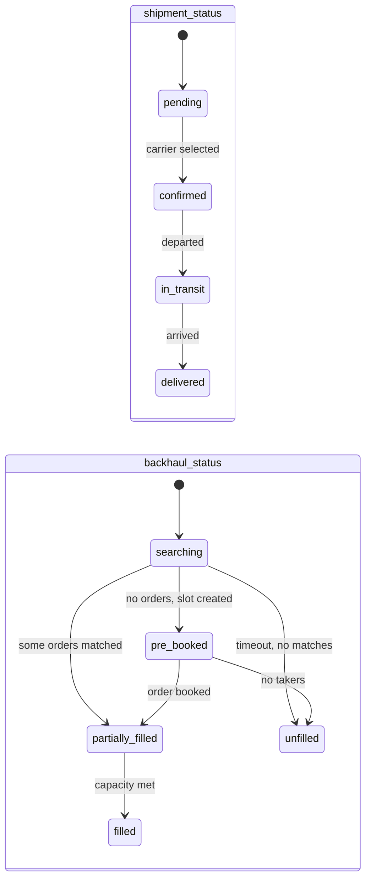

# ERD — MuatBalik AI

> Derived strictly from [PRD Section 8: Data Model MVP](file:///d:/Axel/Lomba/AIC%202026/muatbalik-ai/docs/spec.md)

## Entity Relationship Diagram

```mermaid
erDiagram
    orders ||--o{ shipments : "creates"
    carriers ||--o{ shipments : "assigned to"
    carriers ||--o{ backhaul_slots : "has return capacity"
    backhaul_slots ||--o{ consolidations : "groups orders into"
    consolidations }o--o{ orders : "contains (order_ids JSON)"
    shipments ||--o{ tracking_events : "logs events"

    orders {
        TEXT id PK "UUID"
        TEXT raw_text "Original chat/voice text"
        TEXT origin "e.g. Ambon"
        TEXT destination "e.g. Surabaya"
        TEXT commodity "e.g. tuna"
        REAL weight_kg "300"
        REAL volume_m3 "nullable"
        REAL temperature_min_c "0"
        REAL temperature_max_c "4"
        TEXT pickup_deadline "besok pagi"
        TEXT delivery_deadline "nullable"
        TEXT status "pending | confirmed | matched"
        TEXT created_at "ISO 8601"
    }

    carriers {
        TEXT id PK "UUID"
        TEXT name "e.g. Nusantara Coldline 07"
        TEXT origin "e.g. Ambon"
        TEXT destination "e.g. Surabaya"
        TEXT departure_at "ISO 8601"
        TEXT arrival_at "ISO 8601"
        REAL capacity_kg "1200"
        REAL capacity_m3 "nullable"
        REAL temperature_min_c "-2"
        REAL temperature_max_c "6"
        INTEGER price_idr "4800000"
        REAL rating "4.8"
        TEXT return_origin "e.g. Surabaya"
        TEXT return_destination "e.g. Ambon"
        REAL return_capacity_kg "1000"
        TEXT status "active | inactive"
    }

    shipments {
        TEXT id PK "UUID"
        TEXT order_id FK "→ orders.id"
        TEXT carrier_id FK "→ carriers.id"
        TEXT shipment_status "pending | confirmed | in_transit | delivered"
        TEXT backhaul_status "searching | pre_booked | partially_filled | filled | unfilled"
        INTEGER match_score "0-100 weighted score"
        TEXT match_reasons "JSON array of reason strings"
        TEXT created_at "ISO 8601"
    }

    backhaul_slots {
        TEXT id PK "UUID"
        TEXT carrier_id FK "→ carriers.id"
        TEXT origin "e.g. Surabaya (return origin)"
        TEXT destination "e.g. Ambon (return dest)"
        TEXT departure_at "ISO 8601"
        REAL capacity_kg "1000"
        REAL filled_kg "600"
        INTEGER prebook_discount_pct "15"
        TEXT status "searching | pre_booked | partially_filled | filled | unfilled"
    }

    consolidations {
        TEXT id PK "UUID"
        TEXT backhaul_slot_id FK "→ backhaul_slots.id"
        TEXT order_ids "JSON array of order UUIDs"
        REAL total_weight_kg "540"
        TEXT temperature_range "e.g. 2-8"
        TEXT compatibility_status "compatible | rejected"
        TEXT created_at "ISO 8601"
    }

    tracking_events {
        TEXT id PK "UUID"
        TEXT shipment_id FK "→ shipments.id"
        TEXT event_type "departed | delayed | temperature_excursion | arrived"
        REAL temperature_c "nullable, e.g. 7.2"
        TEXT location "e.g. Makassar hub"
        TEXT note "free text"
        TEXT created_at "ISO 8601"
    }
```

## Table Summary

| Table | PRD Source | Purpose |
|---|---|---|
| `orders` | Section 8 explicit | Raw and parsed order from shipper |
| `carriers` | Section 8 explicit | Fleet registry with route, capacity, temp, return info |
| `shipments` | Section 8 implicit (tracking_events.shipment_id, API /shipments, status machine) | Bridge: links one order to one carrier, holds dual status |
| `backhaul_slots` | Section 8 explicit | Return capacity slot on a carrier |
| `consolidations` | Section 8 explicit | Groups multiple small orders into one backhaul slot |
| `tracking_events` | Section 8 explicit | Simulated logistics events for a shipment |

## Relationships

| Relationship | Cardinality | Notes |
|---|---|---|
| `orders` → `shipments` | 1 : 0..N | An order can be assigned to multiple carriers (e.g. re-match), but typically 1:1 |
| `carriers` → `shipments` | 1 : 0..N | A carrier can serve multiple shipments |
| `carriers` → `backhaul_slots` | 1 : 0..N | Each carrier has at most one active return slot per trip |
| `backhaul_slots` → `consolidations` | 1 : 0..N | Multiple consolidation attempts per slot |
| `consolidations` ↔ `orders` | M : N | order_ids is a JSON array (denormalized for MVP simplicity) |
| `shipments` → `tracking_events` | 1 : 0..N | Multiple events per shipment lifecycle |

## Status Machines (from PRD Section 1)

> [!IMPORTANT]
> `shipment_status` and `backhaul_status` are **independent**. A shipment can be `in_transit` while backhaul is still `searching`. This is a core design principle from the PRD.

## Why `shipments` Table is Needed

The PRD Section 8 does not list `shipments` as an explicit table, but it is **required** by other parts of the spec:

1. **`tracking_events.shipment_id`** (Section 8) — references a shipment entity
2. **API endpoints** (Section 9): `/api/shipments/{id}/match`, `/confirm`, `/backhaul`, `/tracking-events`
3. **Dual status machine** (Section 1): `shipment_status` + `backhaul_status` stored per shipment
4. **User journey step 7** (Section 5): "shipment_status menjadi confirmed" — needs a row to store this

Without a `shipments` table, there is no entity to hold the carrier assignment, match score, or the two independent status fields.
